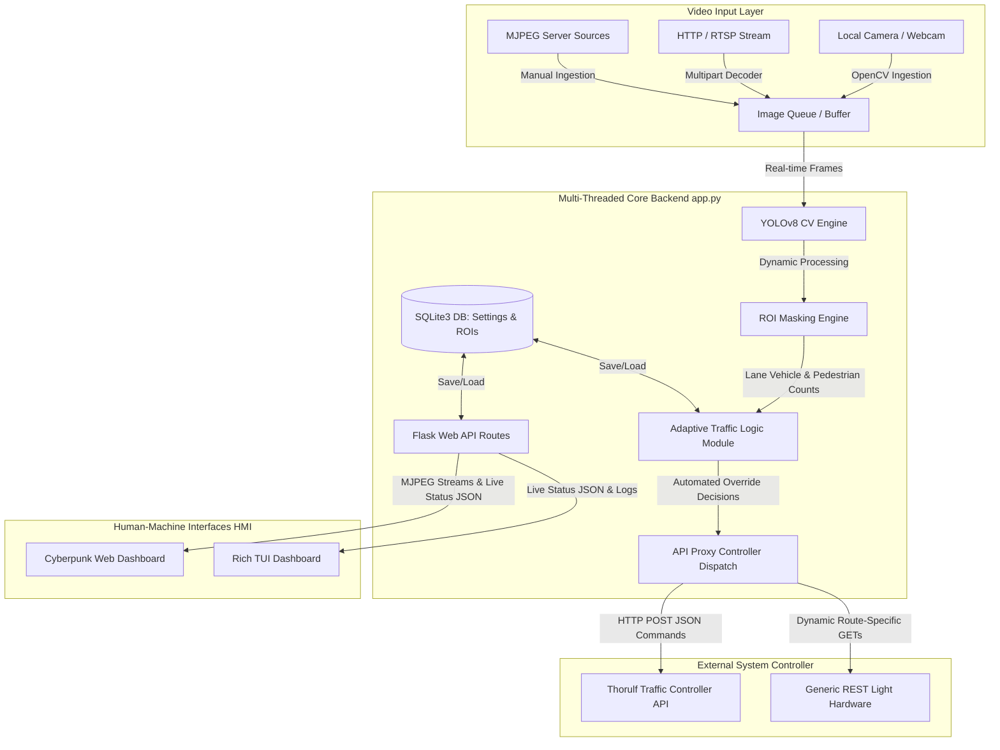

# 🚦 AI-Based Smart Traffic Control System (STMCV)

[](https://www.python.org/)
[](https://flask.palletsprojects.com/)
[](https://github.com/ultralytics/ultralytics)
[](https://opencv.org/)
[](#)

A state-of-the-art, high-performance Traffic Management HMI that leverages Computer Vision and Adaptive AI algorithms to dynamically orchestrate urban traffic flow in real-time. 

---

## 🧭 System Architecture & Data Flow

Below is the conceptual blueprint of the STMCV architecture, mapping real-time multi-threaded ingestion, SQLite3 storage, AI inference models, REST controllers, and active client interfaces:



---

## 🚦 Core Features

### 1. Intelligent AI Object Detection Matrix
* **YOLOv8 Inference Pipeline**: Runs real-time local inference mapping detected objects inside user-drawn Regions of Interest (ROI).
* **Float16 & GPU Acceleration**: Automatically detects Nvidia GPUs, transitioning model tensors to CUDA cores (`cuda:0`) and applying Conv+BN fusion (`model.fuse()`) to maximize throughput (~20+ FPS inference).
* **Multi-Class Keyword Filtering**: Explicitly tracks classes matching keywords: `bicycle`, `car`, `motorcycle`, `bus`, `train`, `truck`, `boat`, `van`, `taxi`, `ambulance`, `scooter`, `auto-rickshaw`, `person`.
* **Dynamic Emergency Priority Overrides**: Automatically isolates sirens and high-profile profiles (`ambulance`, `fire`, `emergency`, `police`) and instantly shifts signal lights to GREEN, halting intersecting lanes.

### 2. Adaptive AI Traffic Control Algorithm (Mode 2)
STMCV supports two primary operating algorithms:
1. **Fixed Cycle (Mode 1)**: Traditional clock-based sequence transitioning green phases evenly.
2. **Adaptive AI Intensity Scheduling (Mode 2)**: Dynamically computes optimal signal allocations using real-time lane weights.

#### The AI Intensity Formula
For every direction ($i \in \{\text{North}, \text{East}, \text{South}, \text{West}\}$), the scheduler calculates a real-time **Intensity Score** every second:

$$\text{Score}_i = (2 \times V_i) + (4 \times H_i) + (0.7 \times W_i) + (5 \times D_i) + (2 \times Q_i) + (1 \times F_i) - C_i + (E_i \times 50)$$

Where:
* $V_i$ = Vehicle Count inside the target Region of Interest (ROI).
* $H_i$ = Heavy Vehicle Count (buses, trucks, trains, auto-rickshaws) - weighted higher to prioritize freight and public transit.
* $W_i$ = Elapsed Wait Time (seconds) - continuously accumulates for red signals to prevent starvation.
* $D_i$ = Density Index: $\min(1.0, \frac{V_i + 2 H_i}{10})$ - relative lane congestion.
* $Q_i$ = Queue Length Proxy (equivalent to current vehicle counts).
* $F_i$ = Flow Rate Proxy ($\frac{V_i}{10}$).
* $C_i$ = Cooldown Bias (10 if lane is green and elapsed phase time < 5s, else 0) - prevents rapid oscillation.
* $E_i$ = Emergency Overrides detected - immediately pushes the lane score by 50+ points for instant green preemption.

#### Active Green Time Boundaries
Green light times are scaled dynamically according to real-time queues:

$$\text{Dynamic Green Time} = \min\left(90\text{s}, \max\left(10\text{s}, 10 + 1.2 V_i + 10 D_i + 0.3 W_i\right)\right)$$

### 3. Fail-Safe Operations & Safeguards
* **Live Ingestion Watchdogs**: Constantly monitors feed heartbeat. If the incoming stream fails, the app halts all API controller updates, switches the system display to a **"Requires LIVE FEED"** standby, and locks automated triggers.
* **CORS Proxy Backend**: Provides built-in bypass routes for browser CORS restrictions by proxying traffic light update payloads through Flask.

---

## 🛠 Technical Design Stack

| Component | Technology | Description |
| :--- | :--- | :--- |
| **Backend Framework** | [Flask 3.1.3](app.py) | Low-latency multipart stream generator, config persistence, API gateway. |
| **Inference Engine** | [Ultralytics YOLOv8](detection.py) | Full-frame single-pass inference running on CPU or CUDA. |
| **Computer Vision** | OpenCV Python | Stream ingestion, image matrix slicing, real-time ROI polygon checks. |
| **Database Engine** | SQLite3 | Local storage of custom ROI coordinates, presets, cameras, and system config. |
| **Terminal Dashboard**| [Rich TUI Dashboard](tui_dashboard.py) | Terminal UI visualizing CPU/RAM, thread health, counts, active phases, and real-time logs. |
| **HMI Interface** | Vanilla ES6+ JS & HTML5 | Canvas polygon editor, cyberpunk styles, active SVG gauges, config forms. |

---

## 📂 Project Structure Blueprint

Browse through the local workspace source files:

* 📄 **[app.py](app.py)**: The main application driver. Initializes Flask routing, manages background SQLite3 operations, handles multi-threaded video stream decoders, and controls proxy requests.
* 📄 **[detection.py](detection.py)**: Houses YOLOv8 inference, custom Region of Interest calculations via `cv2.pointPolygonTest`, and the core Adaptive AI Intensity Traffic Scheduler.
* 📄 **[tui_dashboard.py](tui_dashboard.py)**: Terminal HMI dashboard. Displays terminal logging, CPU/RAM/Disk consumption, lane statuses, and MJPEG active stream thread watches.
* 📂 **[templates/](templates/)**: Markup layers for the Web HMI:
  * [index.html](templates/index.html) - Prime dashboard canvas and viewport grid.
  * [components/topbar.html](templates/components/topbar.html) - Top navbar controller.
  * [components/sidebar.html](templates/components/sidebar.html) - Sidebar links.
  * [components/connection.html](templates/components/connection.html) - Real-time configuration settings.
  * [components/mode2_panel.html](templates/components/mode2_panel.html) - Multi-camera (4-way grid) controls.
* 📂 **[static/](static/)**: Frontend styling, scripts, and icon assets:
  * [css/main.css](static/css/main.css) - Responsive cyberpunk layout styles.
  * [js/script.js](static/js/script.js) - ROI polygon drawing, AJAX polling, WebSocket simulation updates, and canvas render loops.
* 📄 **[start.sh](start.sh)**: Comprehensive bash startup wizard. Performs hardware checks, syncs libraries, validates modules, and starts auto-reload file watches.
* 📄 **[pyproject.toml](pyproject.toml)**: Project configuration and library dependencies manifest.

---

## 🚀 Getting Started

### 📦 1. Installation
The system requires **Python 3.12+**. You can quickly prepare the environment using either standard virtual environments or the `uv` package manager.

```bash
# Clone the repository and navigate inside
cd STMCV

# Using standard python venv
python3 -m venv .venv
source .venv/bin/activate
pip install -r pyproject.toml

# OR using the uv package manager (recommended for speed)
uv sync
```

### ⚡ 2. One-Click Smart Launcher
To verify files, check active GPU capabilities, install dependencies, and run the dashboard with live-reloads:
```bash
chmod +x start.sh
./start.sh
```

### 🖥️ 3. Execution Alternatives

#### Start Standard Web Application Interface
```bash
python app.py
```
* **Web HMI Access**: `http://localhost:5050`

#### Launch Interactive TUI Dashboard
To run the server in a subprocess and monitor logs and server health in the terminal:
```bash
python tui_dashboard.py
```

---

## 🧭 User Dashboard & Operational Workflow

To establish automated traffic control safely, execute the following steps in sequence:

1. **Phase 1: Establish Connection**
   * Access the **Connection Panel** on the UI.
   * Input the **Controller Host** and **Port** (e.g. `127.0.0.1:5000` or local ports).
   * Specify the **Live Feed Source** (e.g., webcam index `0`, video file path, RTSP url, or MJPEG URL).
   * Press **Save Config**.
2. **Phase 2: Perform Heartbeat Diagnostics**
   * Click **Test Live Feed** to confirm the camera feed is healthy.
   * Click **Test Controller API** to confirm communications with the external controller are open.
   * Click **Connect** to link Flask with the physical signal hardware.
3. **Phase 3: Define Regions of Interest (ROI)**
   * Select the **ROI Panel**.
   * Draw the interactive bounding polygon for each lane (North, South, East, West).
   * Save the coordinates, or save them as a custom named preset.
4. **Phase 4: Map Signals & Activate Automation**
   * Map the signal light IDs in the **Traffic Light Panel** to bind the lane names to controller light IDs.
   * Toggle between **Fixed Cycle** or **Adaptive Intensity** mode.
   * Press **Start Automation** to hand over traffic orchestrations to YOLOv8!

---

## 🔌 Comprehensive REST API Reference

The Flask server hosts a robust HTTP REST interface allowing 3rd party dashboards, CARLA nodes, and automated scripting clients to interact with the traffic controller.

### 1. System Operations

#### `GET /api/system`
* **Description**: Fetches current status indicators, active phase timers, and lane occupancy counts.
* **Response Content-Type**: `application/json`
* **Response Schema**:
  ```json
  {
    "connection_status": "Connected | Disconnected | Requires LIVE FEED",
    "system_status": "Running | Stopped",
    "detection_active": true,
    "timer": 24.0,
    "max_timer": 30,
    "current_lane": "North",
    "total_vehicles": 8,
    "logs": []
  }
  ```

#### `POST /api/system`
* **Description**: Starts or stops the background AI traffic orchestrations.
* **Payload Structure**:
  ```json
  { "action": "start | stop" }
  ```
* **Response Schema**:
  ```json
  { "status": "success", "message": "System started" }
  ```

#### `GET /api/config`
* **Description**: Returns all global app configurations parsed from SQLite3.
* **Response Content-Type**: `application/json`

---

### 2. Live Intelligence & Lane Analytics

#### `GET /api/lane_counts`
* **Description**: Fetches current vehicle count statistics, traffic light signals, countdown timers, and camera stream health flags. Used by HMI polling.
* **Response Schema**:
  ```json
  {
    "counts": { "North": 3, "South": 2, "East": 0, "West": 1 },
    "peds": { "North": 1, "South": 0, "East": 0, "West": 0 },
    "green_lane": "North",
    "tl_states": { "North": "green", "South": "red", "East": "red", "West": "red" },
    "timer": 15,
    "cycle_duration": 30.0,
    "connection": "Connected",
    "system_started": true,
    "detect_status": "ACTIVE",
    "feed_status": "ONLINE",
    "mode2_counts": { "North": 3, "South": 2, "East": 0, "West": 1 },
    "mode2_scores": { "North": 12.0, "South": 8.0, "East": 0.0, "West": 4.0 },
    "mode2_peds": { "North": 1, "South": 0, "East": 0, "West": 0 },
    "mode2_thread_health": { "North": true, "South": true, "East": true, "West": true },
    "control_mode": 2
  }
  ```

#### `GET /api/intensity_scores`
* **Description**: Directly extracts detailed mathematical parameters from the Adaptive Scheduler (Mode 2).
* **Response Schema**:
  ```json
  {
    "scores": { "North": 42.6, "South": 15.0, "East": 0.0, "West": 1.2 },
    "wait_times": { "North": 0.0, "South": 12.4, "East": 0.0, "West": 4.1 },
    "green_timers": { "North": 32.4, "South": 18.0, "East": 10.0, "West": 11.2 },
    "densities": { "North": 0.5, "South": 0.2, "East": 0.0, "West": 0.1 },
    "green_lane": "North",
    "is_yellow": false,
    "time_elapsed": 17.6,
    "system_started": true
  }
  ```

---

### 3. Streaming and Snapshot Endpoints

#### `GET /video_feed`
* **Description**: High-speed MJPEG stream containing YOLO bounding boxes and ROI overlays.
* **MIME-Type**: `multipart/x-mixed-replace; boundary=frame`

#### `GET /api/live_feed`
* **Description**: Alias route for third-party tools to fetch the main MJPEG stream with full CORS access headers.

#### `GET /api/camera/status`
* **Description**: Returns quick diagnostic status of incoming feed heartbeat.
* **Response Schema**:
  ```json
  { "status": "online | inactive", "timestamp": 1716382023.15 }
  ```

---

### 4. Multi-Camera Grid Endpoints (Mode 2)

#### `GET /video_feed/mode2/<direction>`
* **Description**: Streams the MJPEG feed for a specific direction (`North`, `South`, `East`, `West`).

#### `GET /snapshot/mode2/<direction>`
* **Description**: Returns a low-latency raw JPEG snapshot for canvas preview.
* **MIME-Type**: `image/jpeg`

#### `GET /snapshot/annotated/mode2/<direction>`
* **Description**: Returns a single JPEG frame overlaid with active YOLOv8 detections.
* **MIME-Type**: `image/jpeg`

#### `POST /api/mode2_config`
* **Description**: Configures camera sources and controls active grid layouts.
* **Payload Examples**:
  * Set specific source:
    ```json
    { "action": "set_source", "dir": "North", "src": "http://127.0.0.1:8080/cam" }
    ```
  * Toggle system mode:
    ```json
    { "action": "toggle_mode" }
    ```

#### `POST /api/mode2_rois`
* **Description**: Defines coordinates for Mode 2 lane-specific Regions of Interest.
* **Payload Examples**:
  ```json
  {
    "dir": "North",
    "points": [[100, 150], [450, 150], [500, 350], [50, 350]]
  }
  ```

---

### 5. Hardware Controller Integration & Manual Override

#### `POST /api/tl_proxy`
* **Description**: Acts as an HTTP gateway to route lane commands, avoiding browser CORS blocks.
* **Payload Example**:
  ```json
  {
    "url": "http://192.168.1.100:8000/lane_controller",
    "state": "green | yellow | red"
  }
  ```

#### `POST /api/tl_test`
* **Description**: Overrides system automation and manually forces a state on a specific signal ID.
* **Payload Example**:
  ```json
  {
    "actor_id": 105,
    "state": "Red | Yellow | Green"
  }
  ```

#### `GET /api/traffic_lights/all`
* **Description**: Contacts the configured controller host and retrieves all active light actor indexes.

#### `POST /api/traffic_light/set_multiple`
* **Description**: Batch proxy that transmits commands to many traffic lights simultaneously.
* **Payload Examples**:
  * Uniform Command:
    ```json
    { "ids": [105, 106], "state": "Green", "freeze": true }
    ```
  * Mixed Commands:
    ```json
    {
      "updates": [
        { "id": 105, "state": "Red", "freeze": true },
        { "id": 106, "state": "Green", "freeze": false }
      ]
    }
    ```

---

### 6. Interactive ROI Configurations

#### `GET /roi_panel`
* **Description**: Returns all current interactive canvas ROI polygon nodes.
* **Response Schema**:
  ```json
  {
    "current_rois": {
      "North": [[120, 200], [480, 200], [520, 360], [80, 360]],
      "South": []
    },
    "roi_enabled": true
  }
  ```

#### `POST /roi_panel`
* **Description**: Saves and activates a set of vertices for a lane ROI.
* **Payload Example**:
  ```json
  {
    "lane": "North",
    "points": [[120, 200], [480, 200], [520, 360], [80, 360]]
  }
  ```

#### `POST /api/roi_enable`
* **Description**: Enables or disables ROI bounding boxes globally during detection processing.
* **Payload Example**:
  ```json
  { "enabled": true }
  ```

#### `POST /api/roi_sets`
* **Description**: Persists active ROIs as a named database preset.
* **Payload Example**:
  ```json
  {
    "name": "RushHourSetup",
    "config": {
      "North": [[120, 200], [480, 200], [520, 360], [80, 360]]
    }
  }
  ```

#### `GET /api/roi_sets/<name>`
* **Description**: Loads coordinates from a named database preset, making them immediately active.

---

## ⚡ Key Advantages

1. **Hardware-Decoupled**: Eliminates the need to install heavy external simulations (like CARLA's Python Client API) directly on the CV processing node, routing requests smoothly over robust REST web loops.
2. **GPU Optimization Out-of-the-Box**: Transparent support for PyTorch GPU inference pipelines.
3. **Multi-cam Dynamic Grid**: Flexible source ingestion allows a single dashboard server to monitor four disparate feeds (webcams, streams, file loops) simultaneously.
4. **Vibrant HMI & TUI Visuals**: Designed to offer an appealing, interactive experience whether working from a standard browser or a server ssh-terminal!
